# SignalRoom AI

> **Know what moved the market. Know why.**

SignalRoom is an AI financial intelligence room. A team of specialised AI agents investigates market events,
cross-checks evidence across **market data, news, SEC filings, PDFs, charts, audio and video**, and produces a concise,
sourced explanation of what happened, why it *likely* happened and what matters next — on screen, as a narrated
audio briefing and by email.

*MIAX — B5-T4 · Design & prototyping of a multimodal-AI FinTech startup. Educational prototype — not investment advice.*

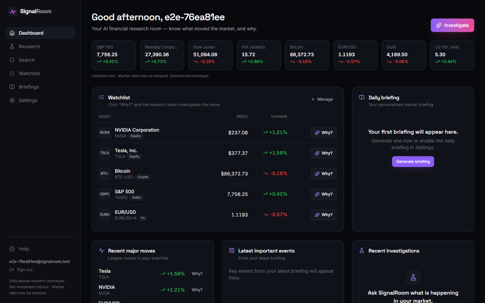

---

## Product

| | |
|---|---|
| **Problem** | Market-moving information is scattered across formats: price feeds, headlines, 10-Qs, earnings-call audio, chart screenshots, macro releases. Retail investors and analysts spend hours stitching it together — and generic chatbots answer confidently without evidence. |
| **Customer** | B2C: self-directed investors and finance students (Free / Pro). B2B2C later: brokers and neobanks embedding "Why did it move?" next to their quotes. |
| **Solution** | Click **Why?** on any asset. An orchestrator assembles only the agents the question needs; numbers are computed in code, models interpret them, every claim links to its source, and driver weights are transparent. |
| **Multimodal value** | Upload an earnings call (audio), a results webinar (video), a results PDF or a chart screenshot and the same team folds them into the investigation, then search everything you researched by meaning or with an image; get the answer back as text, charts, an evidence graph, narrated audio, a visual brief and email. |
| **Business model** | Freemium SaaS: Free (watchlist, daily brief, limited investigations) · Pro ≈ €19/month (deeper investigations, uploads, audio briefings). Measured inference cost ≈ $1.2 per heavy Pro user per month ([cost analysis](docs/cost-analysis.md)). |
| **Trust** | No buy/sell advice, hedged causality ("likely driver"), evidence-weighted contribution (heuristic, not probability), "Not enough evidence available" instead of hallucinations, disclaimer everywhere ([compliance](docs/compliance.md)). |

## How the AI research team works

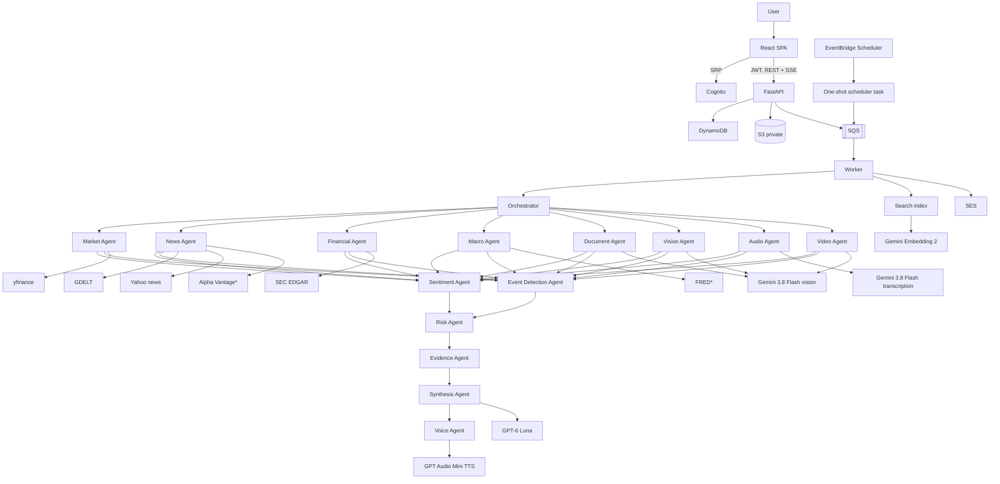
<sub>* optional free keys</sub>

| Agent | Responsibility |
|---|---|
| **Orchestrator** | Classifies intent and selects the *minimal* team (LLM proposal + hard rules). |
| **Market** | Move, returns, volume vs 20d, volatility, drawdown, z-score, anomaly, benchmark-relative move — all in Python. |
| **News** | Retrieve → deduplicate → rank → cluster → model labels clusters from headlines only. |
| **Financial** | SEC XBRL fundamentals (revenue, growth, margins, cash, debt) + filings; never fabricates missing values. |
| **Macro** | Indices, VIX, yields, dollar, oil, gold (+ FRED series). |
| **Document** | PDF text extraction → relevant pages → facts with page numbers; vision on table/chart pages. |
| **Vision** | Chart / table / slide screenshots → observations, levels, uncertainties. |
| **Audio** | Transcription with speakers → earnings analysis with verbatim-verified quotes. |
| **Video** | One multimodal pass over speech **and** on-screen slides: timestamped transcript, slides with figures as displayed, guidance, tone, verified quotes. |
| **Sentiment** | Tone, tone shift, source agreement, evidence confidence (coverage-based). |
| **Event Detection** | Timeline of news, unusual sessions, intraday extremes, filings, guidance. |
| **Risk** | LOW/MEDIUM/HIGH risks citing evidence ids (unsupported ones dropped). |
| **Evidence** | Evidence-weighted driver scores + claims typed as fact / metric / interpretation / hypothesis. |
| **Synthesis** | The "investment committee": final brief, uncertainties, what to watch — with guardrails. |
| **Voice · Briefing · Research Analyst · Visual Brief** | TTS narration, daily editorial briefing, context-aware follow-ups, optional infographic. |

Details: [docs/agents.md](docs/agents.md) · [docs/architecture.md](docs/architecture.md)

### Multimodal flow

```
Text · Image · PDF · Audio · Video · Voice · Market data · News · Filings · Macro
                              ↓
          12 specialised agents (LangGraph, parallel where possible)
                              ↓
                          Synthesis
                              ↓
Text brief · Charts · Evidence graph · Risk radar · Narrated audio · Visual brief · Email · Semantic search
```

| Modality | In | Out | Model / tool |
|---|---|---|---|
| Text → text | questions, follow-ups | brief, explanations | GPT-6 Luna |
| Image/PDF → text | chart screenshots, report pages | structured observations & facts | Gemini 3.8 Flash |
| Audio → text | earnings calls, **voice questions** (mic) | transcript with speakers, analysis | Gemini 3.8 Flash |
| Video → text | results webinars, investor presentations (MP4/WebM/MOV ≤ 40 MB) | timestamped transcript + slides with figures + analysis | Gemini 3.8 Flash |
| Text/image → vectors | every passage of every investigation; text or image queries | multimodal semantic search (`/app/search`), retrieval for follow-ups | Gemini Embedding 2 |
| Text → audio | briefs, daily briefings | narrated WAV | GPT Audio Mini (or Gemini 3.8 Flash TTS) |
| Text → image | verified findings | visual brief (labelled AI illustration) | Gemini 3.1 Flash Image |
| Data → visuals | OHLCV, sentiment, risks | candlesticks, timelines, radar, evidence graph | Lightweight Charts, Recharts, React Flow |

## AI models

One **OpenRouter** key gives access to every model; each role is a configurable env var and can also run on direct
OpenAI / Gemini keys.

| Role | Default (OpenRouter) | Env var |
|---|---|---|
| Reasoning, orchestration, synthesis | `openai/gpt-6-luna` | `OPENAI_MODEL` |
| Vision & documents | `google/gemini-3.8-flash` | `GEMINI_MULTIMODAL_MODEL` |
| Transcription | `google/gemini-3.8-flash` | `GEMINI_TRANSCRIBE_MODEL` (use `gemini-3.5-transcribe` with a direct Gemini key) |
| Text-to-speech | `openai/gpt-audio-mini` | `TTS_MODEL` (`GEMINI_TTS_MODEL=gemini-3.8-flash-tts` with a direct Gemini key) |
| Visual brief | `google/gemini-3.1-flash-image` | `IMAGE_MODEL` |
| Video | `google/gemini-3.8-flash` (speech + frames in one call) | `GEMINI_MULTIMODAL_MODEL` |
| Multimodal embeddings (search) | `google/gemini-embedding-2` | `EMBEDDING_MODEL` |

`gemini-3.5-transcribe` and Gemini TTS are not available through OpenRouter, so with an OpenRouter key transcription
uses Gemini 3.8 Flash (audio input) and TTS uses GPT Audio Mini; the native Gemini adapter (`integrations/ai/gemini.py`)
uses them when `GEMINI_API_KEY` is set. Every call records model, provider, tokens, latency and cost (visible per
investigation in the UI).

## Data sources

| Source | Key | Use |
|---|---|---|
| Yahoo Finance via `yfinance` | none | prices, volume, quotes, search, headlines (delayed, research use) |
| SEC EDGAR APIs | none (User-Agent) | fundamentals, filings |
| GDELT DOC 2.0 | none | news discovery, tone & volume timelines (rate-limited, circuit breaker) |
| Alpha Vantage | free, optional | fallback prices, news sentiment |
| FRED | free, optional | macro series |

[docs/data-sources.md](docs/data-sources.md)

## Screenshots

| | |
|---|---|
| 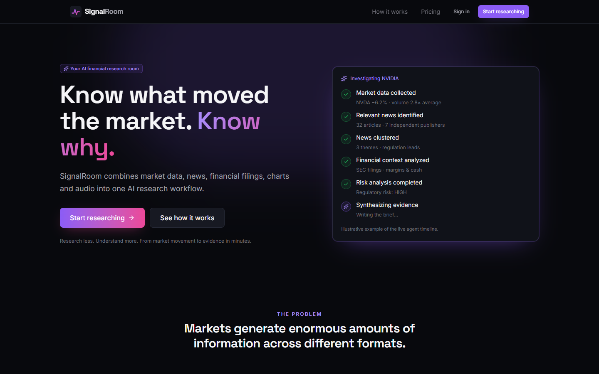 Landing | 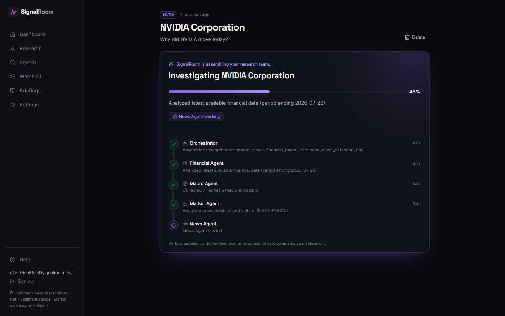 Live agent progress (SSE) |
| 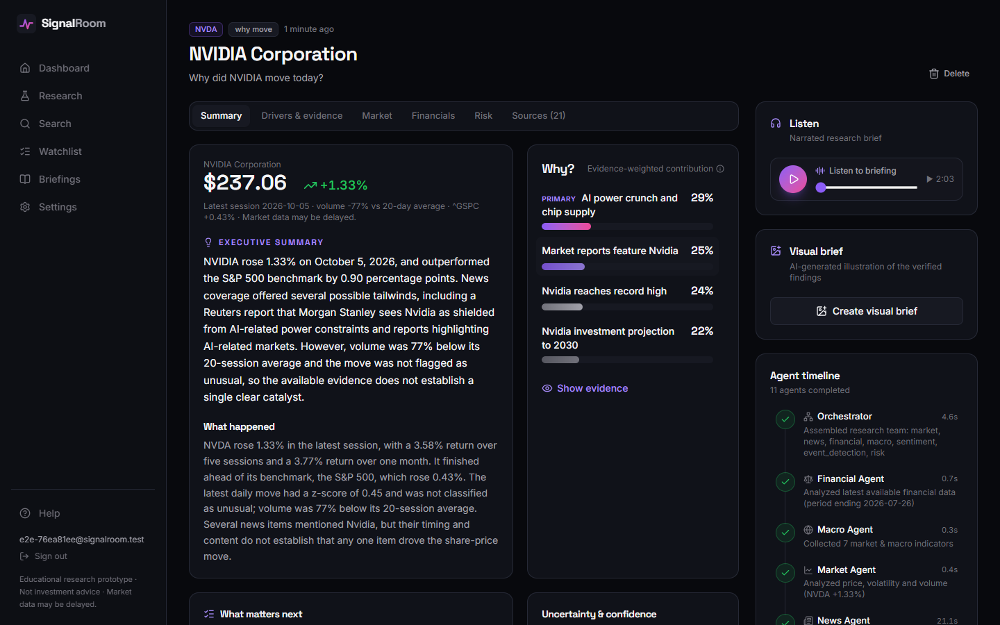 What happened · Why? · Listen | 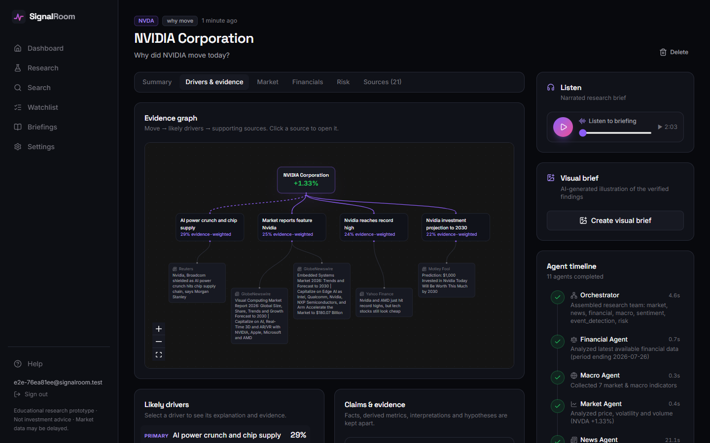 Evidence graph |
| 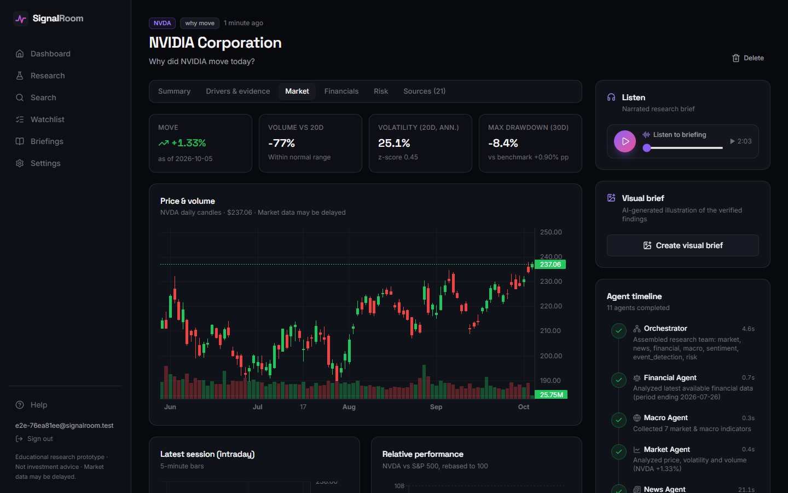 Market & sentiment | 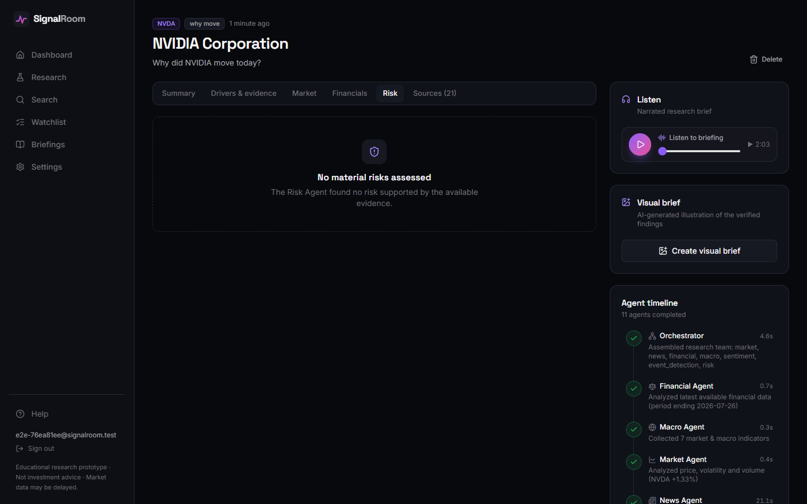 Risk matrix & radar |
| 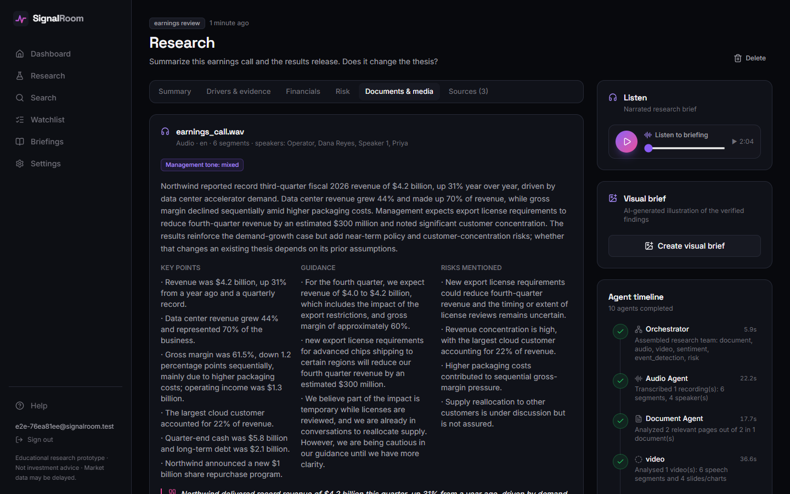 Earnings call + PDF + webinar video | 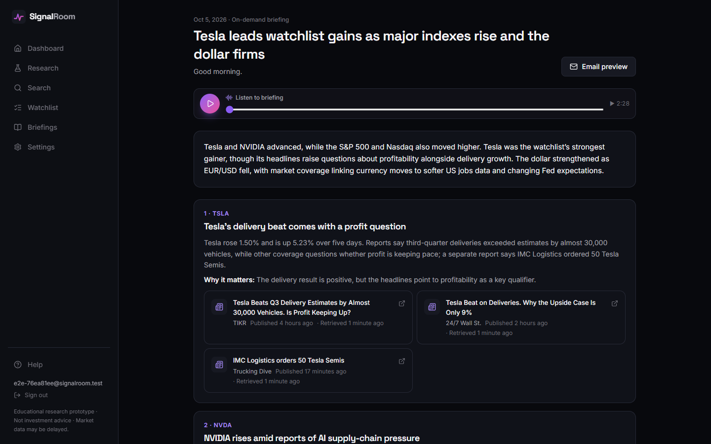 Daily briefing with audio |
| 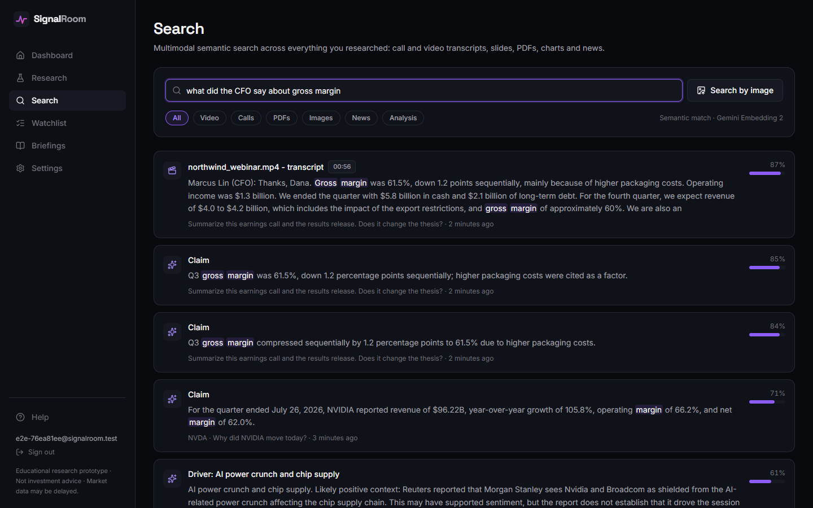 Multimodal semantic search | 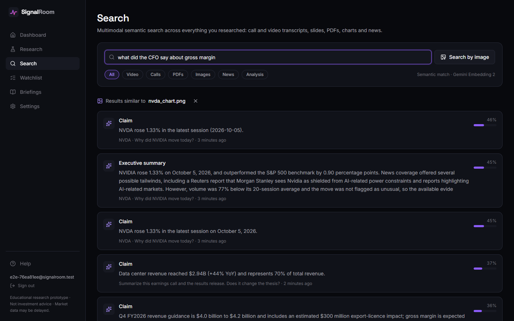 Search by image |
| 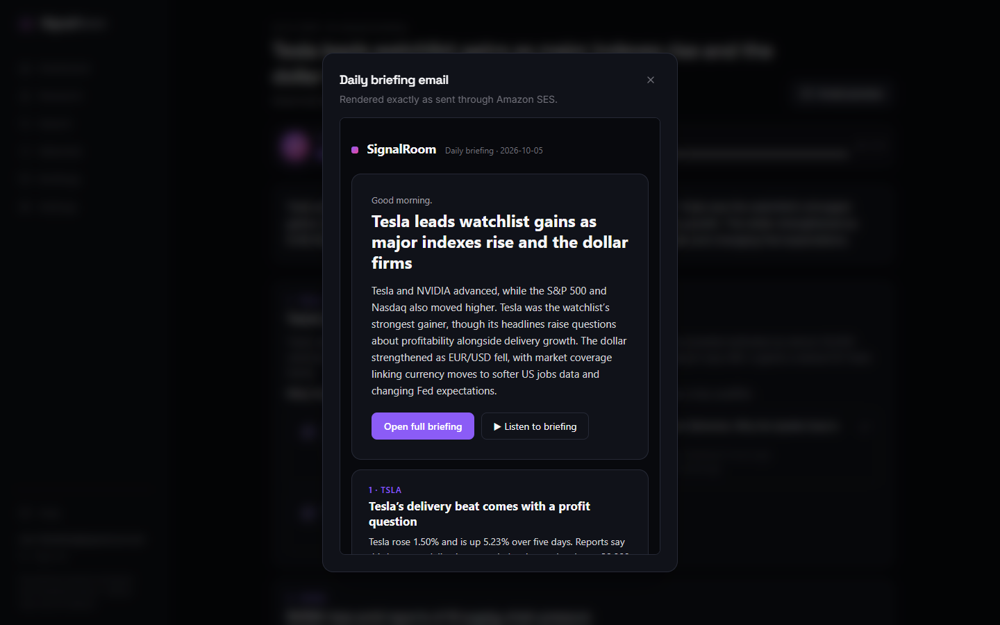 SES email | 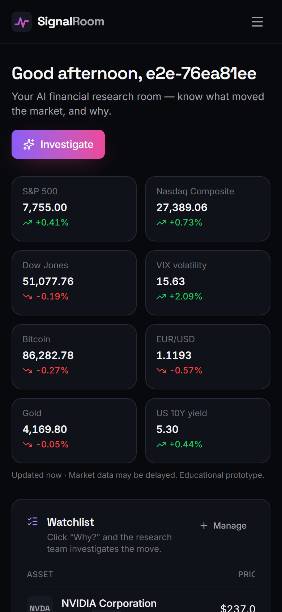 Mobile |

Screenshots are produced by the real-UI Playwright run `scripts/e2e_screenshots.py` against a live local stack.

## Repository structure

```
frontend/   React + TS + Vite + Tailwind · pages/ (incl. About, Privacy, Terms, Methodology) features/ components/ hooks/ lib/
backend/    FastAPI · api/ services/ agents/ workflows/ analytics/ integrations/ repositories/ workers/ prompts/ skills/ templates/
terraform/  modules/{networking,ecr,ecs,alb,s3,cloudfront,cognito,dynamodb,sqs,eventbridge,secrets-manager,iam,ses} · environments/dev
demo_data/  recorded real runs + synthetic earnings call (txt/wav) + synthetic PDF + chart
docs/       architecture, agents, data sources, AWS, local dev, demo script, compliance, cost analysis, email setup
scripts/    dev, test, lint, seed_demo, reindex, record_demo_data, generate_demo_audio/video/assets, e2e_screenshots, set_secrets, deploy (.sh + .ps1)
```

## Local setup

```bash
cp .env.example .env              # add OPENROUTER_API_KEY
./scripts/dev.sh                  # Windows: ./scripts/dev.ps1   → http://localhost:5173
./scripts/seed_demo.sh            # optional: demo@signalroom.ai / DemoPassw0rd with recorded runs
```

Alternatives: `docker compose up --build` (UI :8080) · `docker compose --profile aws-local up --build`
(real AWS code paths on LocalStack) · `cd frontend && VITE_DEMO_MODE=true npx vite` (no backend, no keys — replays
recorded real runs). Full guide: [docs/local-development.md](docs/local-development.md).

## AWS architecture & deployment

CloudFront (free `*.cloudfront.net` HTTPS, **no domain needed**) serves the SPA from private S3 and routes `/api/*` to
an ALB → ECS Fargate (FastAPI). A Fargate Spot worker consumes SQS; EventBridge Scheduler runs a one-shot briefing
scheduler every 15 minutes; DynamoDB, private S3 with presigned URLs, Cognito, SES, Secrets Manager and CloudWatch
complete the stack. No NAT gateway, RDS, Redis or EKS.

```bash
./scripts/deploy.sh               # ECR → image → terraform apply → SPA → CloudFront → ECS
./scripts/set_secrets.sh          # .env → AWS Secrets Manager (keys never go through Terraform or GitHub)
./scripts/deploy.sh --restart-only
```

[docs/aws.md](docs/aws.md) · first-deployment checklist: [NEXT_STEPS.md](NEXT_STEPS.md)

### Who can use the deployed demo

The public demo is protected against strangers spending the API budget: an **email invite list** enforced by a
Cognito pre-sign-up Lambda *and* by the API, an optional **site-wide password** (CloudFront Basic Auth), and
**per-user daily limits** — all set in `terraform.tfvars` ([details](docs/aws.md#budget-protection-who-can-use-the-demo)).

## Environment variables & secrets

All names are in [`.env.example`](.env.example). Locally they come from `.env` (git-ignored). In AWS the ECS tasks
get only non-secret configuration plus `SECRETS_MANAGER_SECRET_ID`; at start-up they load
`OPENROUTER_API_KEY`, `ALPHAVANTAGE_API_KEY`, `FRED_API_KEY`, `SEC_USER_AGENT`, `SES_FROM_EMAIL` from **AWS Secrets
Manager** (`backend/app/config/secrets.py`). The browser only receives public Vite variables (API URL, Cognito ids).

## Quality

| Check | Result |
|---|---|
| Backend `pytest` (unit, agents, LangGraph workflow, API authz & isolation, invite-only access & limits, SSE, moto AWS adapters, scheduler idempotency, Cognito Lambda) | 114 passed |
| Backend live tests (`RUN_LIVE_TESTS=1`: OpenRouter, yfinance, SEC, news, transcription, TTS, full investigation) | 6 passed |
| `ruff` · `mypy` | clean |
| Frontend `vitest` (login guard, watchlist, investigation creation & states, charts, errors, SSE parser) | 23 passed |
| `eslint` · `tsc -b` · `vite build` (normal + demo) | clean |
| Playwright E2E through the real UI (incl. automatic check of every public and in-app link) | passed, no console errors, no broken links |
| `terraform fmt -check` · `terraform validate` | clean |
| Docker images (backend, frontend) | build |
| LocalStack run (API + SQS worker + DynamoDB + S3 + Secrets Manager + scheduler) | passed |

CI: `.github/workflows/ci.yml` (backend, frontend, terraform, docker).

## Limitations

* yfinance data is unofficial and possibly delayed; not licensed for commercial use.
* GDELT rate-limits some networks; the circuit breaker falls back to Yahoo/Alpha Vantage headlines.
* Headlines only (no article bodies); evidence-weighted contributions are heuristics, not causal estimates.
* SEC fundamentals cover U.S. registrants; non-US equities, crypto and FX get market/news analysis only.
* Inline audio transcription is limited to 25 MB per file, videos to 40 MB (≈ 15–20 min at webinar quality); the voice command endpoint to 4 MB WAV.
* Semantic search scans each user's last 100 investigations in memory (fine for a prototype; a vector store such as OpenSearch/pgvector would replace it at scale).
* SES sandbox requires verified recipients; email from a Gmail sender may land in spam.
* Academic security posture (public-subnet tasks, HTTP between CloudFront and ALB, per-process rate limiting).

## Financial disclaimer

SignalRoom is an educational financial research prototype. Its analysis is generated from available data and AI
models and may contain errors. It does not provide personalized investment advice, execute trades, or guarantee the
accuracy or completeness of market information.

## Roadmap

1. Portfolio-level "Why did my portfolio move?" and alerts on unusual moves (push / email).
2. Licensed real-time data and news bodies with entity linking; multilingual news (Spanish/European sources).
3. Earnings-call live mode (streaming transcription) and long-video support (chunked analysis of > 40 MB webinars).
4. Backtested evaluation of driver scores vs post-event returns; human feedback on explanations.
5. Private subnets + WAF, custom domain, SOC 2-style controls; B2B2C widget for brokers.
