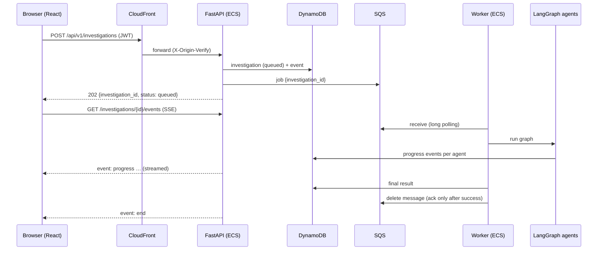
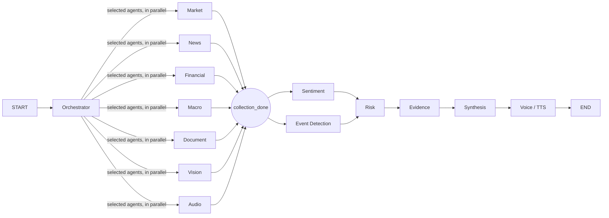

# Architecture

SignalRoom separates three layers cleanly:

| Layer | Folder | Responsibility |
|---|---|---|
| UI | `frontend/` | React + TypeScript SPA. Pages are thin; data access lives in `hooks/` (React Query) and `lib/api`. |
| HTTP API | `backend/app/api/` | FastAPI routes only: auth, validation, mapping to services. |
| Business logic | `backend/app/services/` | Use cases (create investigation, uploads, watchlist, briefings, deletion). |
| Orchestration | `backend/app/workflows/` | LangGraph investigation graph, follow-ups, briefing flow, media jobs, progress reporting. |
| Reasoning units | `backend/app/agents/` | One file per agent; depend only on interfaces injected through `AgentContext`. |
| Deterministic analytics | `backend/app/analytics/` | Returns, volatility, drawdown, z-scores, clustering, driver scoring, SEC fundamentals. |
| Integrations | `backend/app/integrations/` | AI (OpenRouter / OpenAI / Gemini), market (Yahoo, Alpha Vantage), news (GDELT, Yahoo, Alpha Vantage), SEC, FRED, S3, SQS, SES. |
| Persistence | `backend/app/repositories/` | DynamoDB and local JSON implementations behind the same protocols. |
| Composition root | `backend/app/container.py` | The only place that picks concrete implementations (local vs AWS). |

Agents never import `yfinance`, `httpx`, `boto3`, `openai` or Google SDKs.

## Request & job flow

## Investigation graph (LangGraph)

* Nodes not selected by the orchestrator return immediately (no events, no cost).
* Parallel branches write to separate state keys; `sources`, `agent_runs` and `warnings` use reducers.
* Every agent failure is caught: the investigation continues and a safe warning is shown.
* Progress = completed agent steps / planned steps (never a fake timer).

## Async vs BackgroundTasks vs scheduled jobs

| Mechanism | Used for |
|---|---|
| `async def` endpoints | All API I/O (DynamoDB/S3 via thread offload, presigning, SSE). |
| FastAPI BackgroundTasks | Not used for any important work. |
| SQS + ECS worker | Investigations, follow-ups, document/image/audio analysis, TTS, image generation, briefings, emails. |
| EventBridge Scheduler → one-shot ECS task | Every 15 min: find users due (timezone + local time + not yet delivered) and enqueue briefing jobs. |

Locally (`BACKEND_MODE=local`) the same `Worker` loop runs in a background thread against an in-memory queue, so a laptop needs no AWS. The `aws-local` docker-compose profile runs the real AWS code paths against LocalStack with a separate worker container.

## Idempotency

* Investigation jobs: a completed investigation is skipped on redelivery; a retried job restarts cleanly.
* Audio/visual brief: not regenerated if already `ready`.
* Daily briefings: `briefing_deliveries` conditional write on `user_id#local_date#daily`; email sent only if `email_status != sent` and the delivery marker has no `email_sent`.

## Security model

* Cognito JWTs validated with JWKS (signature, issuer, expiry, `token_use`, audience / `client_id`).
* The user id always comes from the token. Every read checks ownership and returns 404 for other users' data.
* Uploads: extension + MIME + size validated before presigning; magic bytes checked after upload; keys are prefixed `users/{user_id}/`.
* Private S3 with TLS-only bucket policy and presigned URLs; CloudFront → ALB protected by a secret header + CloudFront prefix list.
* Structured JSON logs with request/job/investigation ids and a hashed user ref; API keys, JWTs and bearer tokens are redacted.
* Simple per-client rate limiting; CORS restricted to the app origin; security headers.
